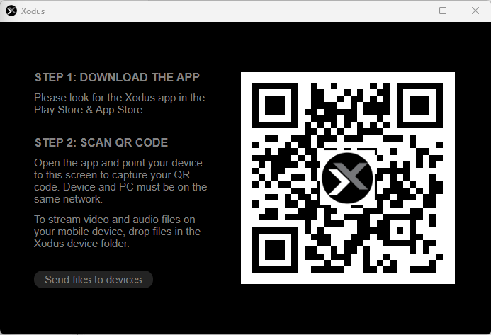
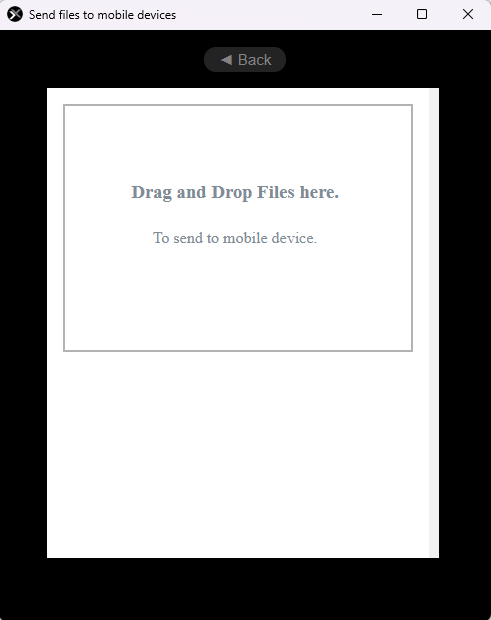
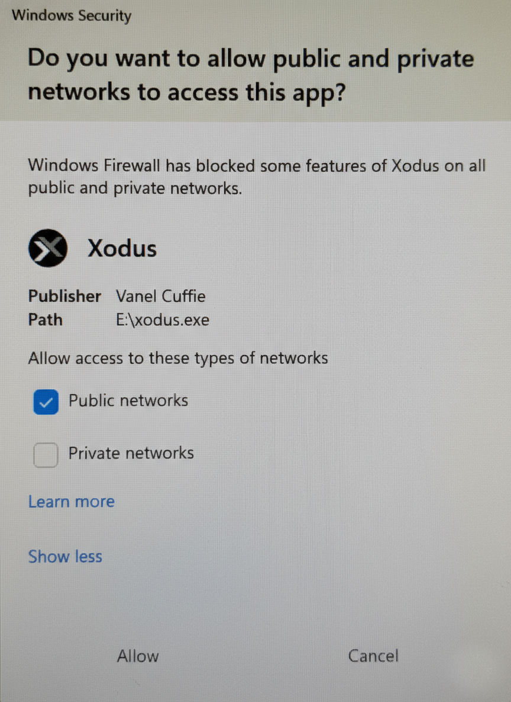

# Xodus — Secure Local-First File Sharing & Media Streaming System

## Overview

Xodus is a **secure, local-first file sharing and media streaming system**
built around a **custom USB hardware device** and **cross-platform companion applications**.

The project is designed to prioritize:
- privacy by design
- minimal cloud dependency
- strong encryption
- safe, user-friendly security workflows

Xodus is intended for environments where users want to share files or stream
media **without relying on third-party cloud services**, while maintaining
clear trust boundaries and reducing attack surface.

---

## Core Design Principles

### 1. Local-First & Offline-Capable
Xodus operates primarily on local networks and does not require an internet
connection for core functionality. This reduces exposure to external threats
and supports use in bandwidth-limited or privacy-sensitive environments.

### 2. Hardware-Backed Trust
A custom **Xodus USB dongle** acts as a secure, portable endpoint that anchors
trust between devices. The hardware component helps separate sensitive
operations from general-purpose systems.

### 3. Privacy by Default
- No mandatory cloud accounts
- No background telemetry
- No permanent storage of streamed media on receiving devices
- User-controlled pairing and trust decisions

### 4. Secure, Human-Friendly UX
Security workflows are designed to be understandable and usable by
non-technical users, reducing configuration errors and unsafe behavior.

---

## Key Capabilities

### Secure File Sharing
- Encrypted file transfers between trusted devices
- Explicit user approval for sharing actions
- Designed for temporary or controlled exchanges

### Encrypted Local Media Streaming
- Stream audio or video over a local connection
- Media is not permanently stored on the receiving device
- Intended for personal use, demos, and controlled sharing scenarios

### QR-Based Device Pairing
- Pair devices using a QR code instead of manual key handling
- Reduces user error and improves onboarding security
- Establishes a trusted relationship before any data exchange

### Cross-Platform Support
- Desktop and mobile companion applications
- Consistent security behavior across platforms
- Designed to scale from personal use to small studio environments

---

## Prototype Evidence & Security Workflow

The following screenshots demonstrate Xodus operating as a **secure, local-first
file sharing and media streaming system** with hardware-backed trust and
explicit user-controlled pairing.

---

### Hardware-Backed Trust Anchor

*Custom Xodus USB dongle acting as a portable trust anchor.  
Sensitive trust relationships and pairing credentials are anchored to the
hardware device rather than relying solely on the host operating system.*

---

### Secure Device Pairing (QR-Based)

*QR-based pairing workflow used to establish trusted device relationships.
This approach avoids manual key handling, requires physical proximity, and
ensures that no data exchange occurs before explicit user approval.*

---

### Explicit, User-Initiated File Sharing

*User-initiated file sharing interface.  
Files are transferred only after explicit user action and only between
previously paired, trusted devices. There is no background or automatic sharing.*

---

### Host Operating System Security Controls (Advanced)

*Xodus respects host operating system security controls.  
Network access requires explicit user approval through the OS firewall, and
Xodus does not bypass or suppress these protections. Default operation favors
least-privilege configurations.*

---

## Notes on Security & Privacy

- Xodus does not perform passive device surveillance or network scanning
- All data exchange occurs only between explicitly paired devices
- Local-first operation minimizes exposure to external networks
- Security-relevant actions are visible and user-controlled

These design choices reinforce Xodus’ focus on **privacy, safety, and
understandable security workflows** rather than convenience-driven automation.

---

## What Xodus Is *Not*

- ❌ Not a network scanning or surveillance tool  
- ❌ Not a cloud file-hosting platform  
- ❌ Not a hacking or penetration-testing utility  
- ❌ Not designed for anonymous or uncontrolled sharing  

Xodus intentionally avoids features that would increase risk, misuse, or
privacy violations.

---

## Repository Contents

- `threat-model.md`  
  Threat analysis, trust boundaries, and mitigation strategy

- `architecture.md`  
  High-level system architecture and data flow

- `security-use-cases.md`  
  Practical, defensive scenarios where Xodus provides value

- `prototype/`  
  Early experiments, proofs of concept, and implementation notes

---

## Security Philosophy

Xodus follows a **defensive security mindset**:
- minimize attack surface
- favor explicit trust over implicit discovery
- encrypt data in transit
- avoid unnecessary persistence
- keep users informed and in control

The project emphasizes **responsible system design** rather than maximizing
features.

---

## Status

Xodus is currently in the **design and early prototype phase**.
Documentation, threat modeling, and UX security decisions are prioritized
before full feature implementation.

Future development will focus on:
- refining secure pairing
- strengthening encryption workflows
- improving usability without sacrificing safety

---

## Intended Audience

- Privacy-conscious individuals
- Artists and creators sharing work locally
- Small studios or temporary environments
- Anyone interested in local-first, secure system design

---

## Disclaimer

Xodus is an experimental project intended for educational and defensive
purposes. It is not designed to bypass security controls or facilitate
unauthorized access.

---

**End of Xodus README**
